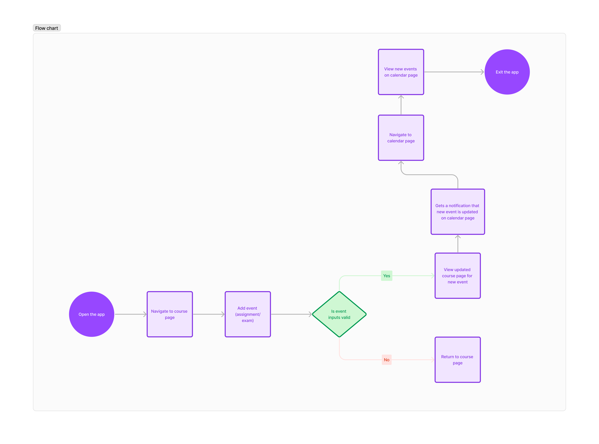
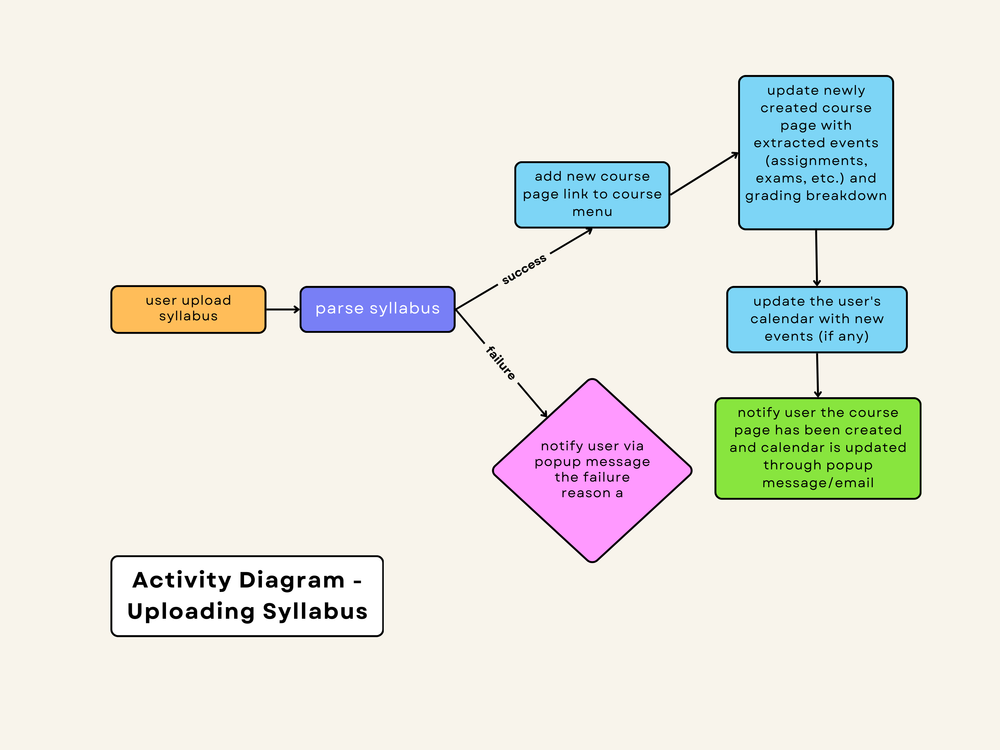

# Specification Phase Exercise

A little exercise to get started with the specification phase of the software development lifecycle. See the [instructions](instructions.md) for more detail.

## Team members

Juliann Zhou

## Stakeholders

Celine Yu. Celine is my roommate and she likes to keep things organized. She spends a lot of time keeping track of a course requirements and making calendar events. It would be very helpful for her if there were an app that can generate a study plan and calendar automatically for her so she doesn't have to spend so much time making to-do lists in Notion. 

Four needs/frustrations:
1. being able to view critical information of syllabi for different courses at on place.
2. keep track of assignments, exams, and project deadlines.
3. keep track of goals for different assignments.
4. have a calendar of important events (assignments, exams, and project) created automatically.

## Product Vision Statement

Syllabus.io converts your syllabus into a personalized schedule and to-do list. syllabus.io reads basic course info, course content, assignment deadlines, exam dates, as well as grade percentage distribution from your uploaded syllabi and organizes the information into a personalized to-do list and schedule. 

## User Requirements
* as non-registered user, I can register a new account with the site
* as a user, I can log in to the site
* as a user, I can upload syllbi to the site
* as a user, I can create events (assignments, presentations, projects, exams, ...) with deadlines.
* as a user, I can set goals (i.e. expected grade for the event) for each event.
* as a user, I can view all my events and deadlines.
* as a user, I can edit and delete my events/deadlines.
* as a user, I can view my goals.
* as a user, I can edit and delete my goals.
* as a user, I can view my auto-generated study calendar with calendar events for every course. 

## Activity Diagrams

### Create an event for a course

### Upload syllabus

## Wireframes

https://www.figma.com/file/h85z73dQDwRdbRnn9t29VU/Project-1---Syllabus.io?type=design&mode=design&t=DVZXbaKG5hGAKpFF-1

## Clickable Prototype

https://www.figma.com/proto/h85z73dQDwRdbRnn9t29VU/Project-1---Syllabus.io?type=design&node-id=3-339&t=GOJOtyGg2T5GY0jh-1&scaling=scale-down&page-id=0%3A1&starting-point-node-id=3%3A339&mode=design