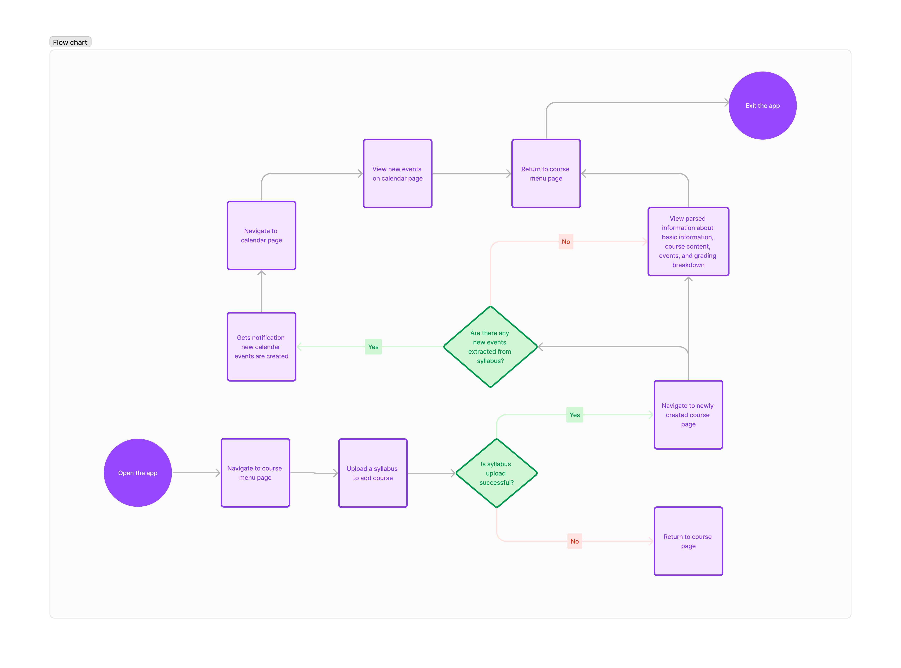

# Specification Phase Exercise

A little exercise to get started with the specification phase of the software development lifecycle. See the [instructions](instructions.md) for more detail.

## Team members

Juliann Zhou

## Stakeholders

Celine Yu. Celine is my roommate and she likes to keep things organized. She spends a lot of time keeping track of a course requirements and making calendar events. It would be very helpful for her if there were an app that can generate a study plan and calendar automatically for her so she doesn't have to spend so much time making to-do lists in Notion. 

## Product Vision Statement

Are you cramming for an exam the night before the exam? Are you scrambling to finish the last word of your paper before due date? Then syllabus.io is for you!!! This web app converts your syllabus into a personalized schedule and to-do list. syllabus.io reads basic course info, course content, assignment deadlines, exam dates, as well as grade percentage distribution from your uploaded syllabi and organizes the information into a personalized to-do list and schedule. It will let you set your goal for each course (number of hours to study, desired grade) and calculate the grades you need to achieve for each assignment, as well as organize your study plan into a to-do list and schedule.

## User Requirements
* as non-registered user, I can register a new account with the site
* as a user, I can log in to the site
* as a user, I can upload syllbi to the site
* as a user, I can create events (assignments, presentations, projects, exams, ...) and set goals (i.e. expected grade for the event) for each course/syllabus uploaded
* as a user, I can view the the uploaded syllabus, the grading breakdown, and my goals
* as a user, I can view my auto-generated study calendar with calendar events for every course inputted to the calendar based on available information about deadlines in the syllabus and my inputs for events/goals.


The application will store Users, Courses / Syllabi, Dates, Assignments, Course Content

users can have multiple courses
each course can have basic info, course content by week, and multiple assignments, quizzes, exams
(sample documents)

An Example User:
```
{
  username: "workhardplayhard123",
  hash: // a password hash,
  syllabi: // an array of uploaded syllabi
  course:  {
              "Software Engineering": { "syllabus": (url path to syllabus)}
           }
           // stored as an mixed object in javascript object form
  goals:  {
              "Assignment 1": "90",
              "Assignment 2": "100"
              ,,,
           }
            // stored as an mixed object in javascript object form
            
            
   
}
```

## Activity Diagrams

### Create an event for a course


### Upload syllabus


## Site map (to clarify structure of the app for activity diagrams)


## Clickable Prototype

See instructions. Delete this line and place a publicly-accessible link to your clickable prototype here.
